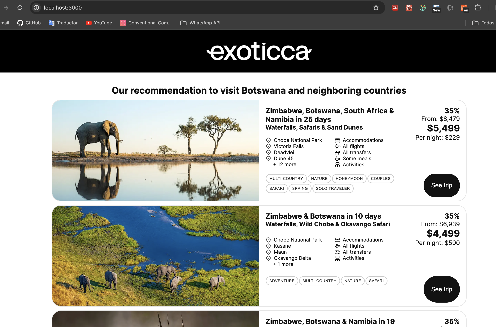
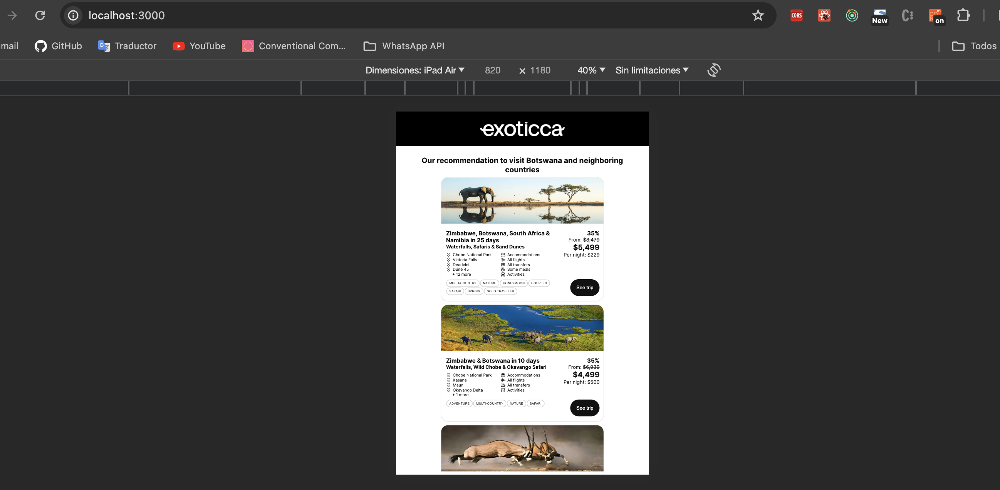
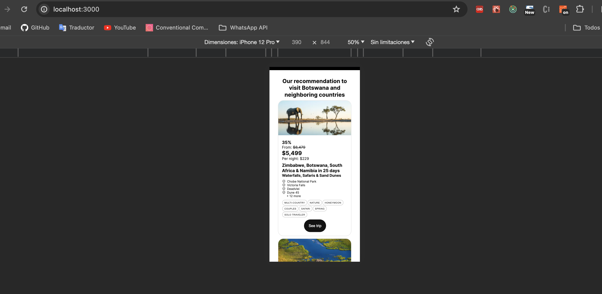

This is a [Next.js](https://nextjs.org/) project bootstrapped with [`create-next-app`](https://github.com/vercel/next.js/tree/canary/packages/create-next-app). to display a Product Card

## Getting Started

First, run the development server:

```bash
npm run dev
# or
yarn dev
# or
pnpm dev
# or
bun dev
```

Open [http://localhost:3000](http://localhost:3000) with your browser to see the result.

## UI






## Run test

First, run the development server:

```bash
npm run test
# or
yarn test
# or
pnpm test
# or
bun test
```

## Deployed on Vercel
